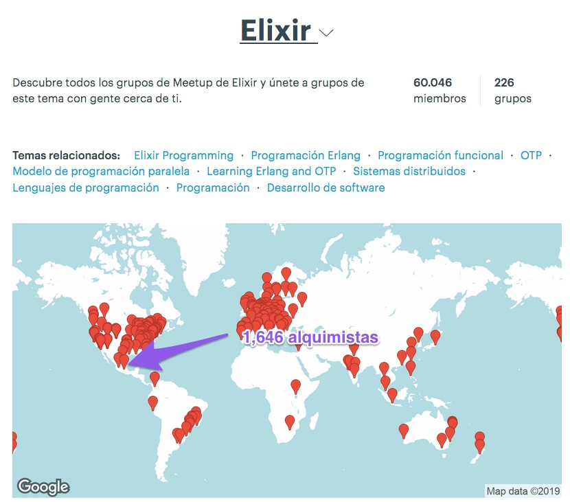

#¿Elixir en producción?

---

#Ivanhoe

- Ingeniero de Software, Tec CCM
- Bunsan
- @ivanhoe - > https://twitter.com/ivanhoe
- github -> https://github.com/ivanhoe

---
#Elixir Mexico City Meetup

---
#Admins

- Norberto Ortigoza(@hiphoox)
- Agustín Ramos(@machineareus)
- Iván Álvarez(@ivanhoe)

---

---

##Global

- Whatsup
- Facebook
- Pinterest
- Toyota
- http://elixir-companies.com/

^ Agregar imagen la URL, mencionar que puedes hacer PR

---

##Nuestro contexto, México
---

##Startups

- Nubleer
- Conekta
- Bussi
- Eiya
- RocketJourney

---

##Grandes Corporativos

- Resuelve tu deuda
- Miio
- HoneyWell
- EBC
- Dos de los PACs más grandes de México

---

##Retos

- Perder el miedo a una tecnología emergente, al no contar con una empresa gigantesca detrás
- Realizar pruebas de concepto
- Convencer con hechos y evidencias a Managers
- Paciencia para afrontar la curva de aprendizaje
- Adquirir nuevos desarrolladores

---

##Beneficios

- Nuestros sistemas se encuentran listos para ejectuarse de manera concurrente(programación funcional?
- Contar con una máquina virtual sumamente robusta como es la BEAM
- Menor inversión en infraestructura
- Desarrolladores más contentos al trabajar con una plataforma estable y llena de herramientas muy bien pensadas
- Comunidad altamente activa con múltiples proyecto

---

##Consultores

- Michelada.io
- Making Devs
- Bunsan(entramiento y primeros pasos)

---

##Demo 

---

##Conclusión

- Elixir te va ayudar a que te enfoques mucho más en tu negocio que en temas de infraestructura, deployment, escalabilidad, concurrencia.

---

##Q & A

---

##Contacto

- http://bunsan.io
- Ivn Alvarez -> ivan@bunsan.io
- Misael Pérez -> misael@bunsan.io